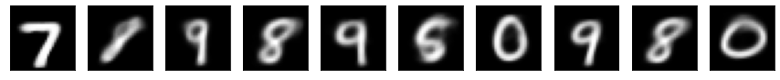

# Variational Auto Encoder
This repository aims to implement a Variational Auto Encoder
to generate images that could belong to the MNIST dataset.

This project comes from a lab exercise of the Deep Learning course
taught in the first year of the Artificial Intelligence master of 
the university Paris-Saclay.

## Generated images

